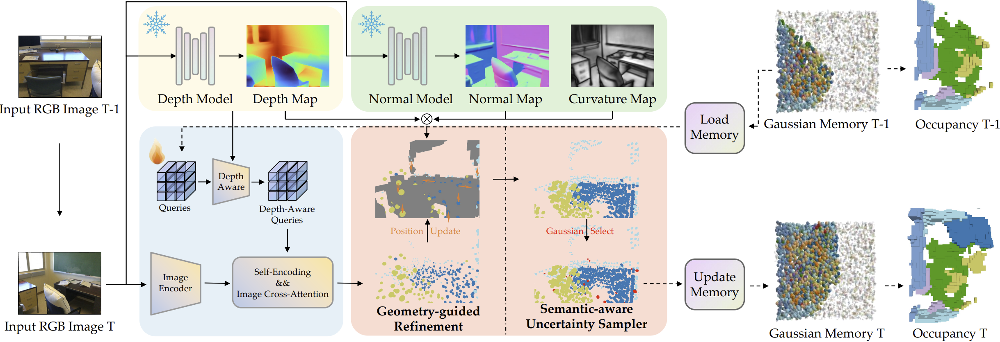

# EmbodiedOcc2

## Overview

Online 3D occupancy prediction provides a comprehensive spatial understanding of embodied environments. While the innovative EmbodiedOcc framework utilizes 3D semantic Gaussians for progressive indoor occupancy prediction, it overlooks the geometric characteristics of indoor environments, which are primarily characterized by planar structures. This paper introduces EmbodiedOcc++, enhancing the original framework with two key innovations: a Geometry-guided Refinement Module (GRM) that constrains Gaussian updates through plane regularization, along with a Semantic-aware Uncertainty Sampler (SUS) that enables more effective updates in overlapping regions between consecutive frames. GRM regularizes the position update to align with surface normals. It determines the adaptive regularization weight using curvature-based and depth-based constraints, allowing semantic Gaussians to align accurately with planar surfaces while adapting in complex regions. To effectively improve geometric consistency from different views, SUS adaptively selects proper Gaussians to update. Comprehensive experiments on the EmbodiedOcc-ScanNet benchmark demonstrate that EmbodiedOcc++ achieves state-of-the-art performance across different settings. Our method demonstrates improved edge accuracy and retains more geometric details while ensuring computational efficiency, which is essential for online embodied perception. 