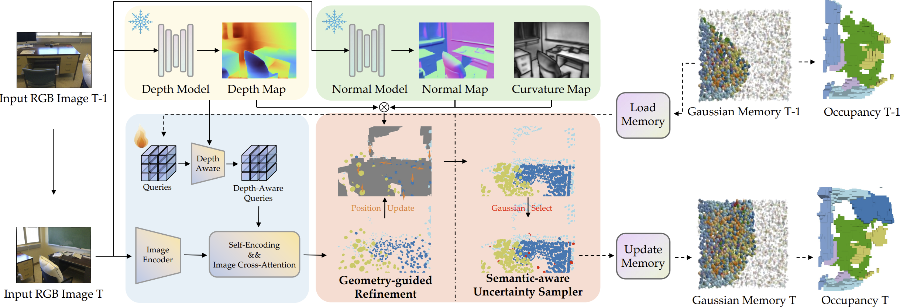

<div align="center">

# EmbodiedOcc++: Boosting Embodied 3D Occupancy Prediction with Plane Regularization and Uncertainty Sampler


  
[🌐**Project Page**](https://pkuhaowang.github.io/EmbodiedOcc2/) | [✍️**Paper(Arxiv)**](https://arxiv.org/abs/2504.09540) | [🎥**Demo**](https://pkuhaowang.github.io/EmbodiedOcc2/)

[Hao Wang](https://pkuhaowang.github.io/)\*, [Xiaobao Wei](https://ucwxb.github.io/)\*, [Xiaoan Zhang](https://github.com/Paipai-zxa), [Jianing Li](https://github.com/NorthSummer), [Chengyu Bai](https://github.com/Bbmyy), [Ying Li](https://github.com/myendless1),

[Ming Lu](https://lu-m13.github.io/), [Wenzhao Zheng](https://wzzheng.net/), [Shanghang Zhang](https://www.shanghangzhang.com)

</div>



**EmbodiedOcc++** enhances 3D semantic Gaussians with a Geometry-guided Refinement Module (GRM) for planar regularization and a Semantic-aware Uncertainty Sampler (SUS) for adaptive updates, achieving efficient and geometrically consistent online 3D occupancy prediction.

## ✨ News ✨
- [2025/08/01] The EmbodiedOcc++ code has been officially released! 🎉 Check it out now for detailed implementation and usage.

- [2025/07/05] EmbodiedOcc++ is accepted by ACM MM 2025! 🎉 Stay tuned for more updates!

- [2025/04/13] EmbodiedOcc++ is now live on arXiv! 🚀 


## 📦 Installation

<details>
<summary>1. Create conda environment</summary>

```bash
conda create -n embodiedocc python=3.8.19
conda activate embodiedocc
```

</details>

<details>
<summary>2. Install PyTorch</summary>

```bash
pip install torch==1.12.1 torchvision==0.13.1 torchaudio==0.12.1 --index-url https://download.pytorch.org/whl/cu113
```

</details>

<details>
<summary>3. Install some packages following [GaussianFormer](https://github.com/huang-yh/GaussianFormer)</summary>

3.1. Install packages from MMLab

```bash
pip install openmim==0.3.9
mim install mmcv==2.0.1
mim install mmdet==3.0.0
mim install mmsegmentation==1.2.2
mim install mmdet3d==1.1.1
```

3.2. Install other packages
```bash
pip install spconv-cu114==2.3.6
pip install timm
pip install vtk==9.0.1
```

3.3. Install custom CUDA ops
```bash
git clone --recursive https://github.com/PKUHaoWang/EmbodiedOcc2.git
cd EmbodiedOcc2
cd model/encoder/gaussianformer/ops && pip install -e .
cd model/head/gaussian_occ_head/ops/localagg && pip install -e .
```

</details>

<details>
<summary>4. Install the additional dependencies</summary>

```bash
cd EmbodiedOcc2
pip install -r requirements.txt
```

</details>

<details>
<summary>5. Download Depth-Anything-V2 and make some slight changes</summary>
 
```bash
cd EmbodiedOcc2
git clone https://github.com/DepthAnything/Depth-Anything-V2.git
```

**Folder structure**
```
EmbodiedOcc2
├── ...
├── Depth-Anything-V2
```

Go to **Depth-Anything-V2/metric_depth/depth_anything_v2/dpt.py** and change the function **infer_image** in the class **DepthAnythingV2** as follows:
```Python
def infer_image(self, image, h_, w_, input_size=518):
    depth = self.forward(image)
    depth = F.interpolate(depth[:, None], (h_, w_), mode="bilinear", align_corners=True)[0, 0]
    return depth
```

</details>

<details>
<summary>6. Download EfficientNet-Pytorch</summary>
 
```bash
cd EmbodiedOcc
git clone https://github.com/lukemelas/EfficientNet-PyTorch.git
```

**Folder structure**
```
EmbodiedOcc2
├── ...
├── Depth-Anything-V2
├── EfficientNet-Pytorch
```

</details>

<details>
<summary>7. Download the finetuned checkpoint </summary>

Download the [finetuned checkpoint](https://huggingface.co/YkiWu/EmbodiedOcc) of Depth-Anything-V2 on Occ-ScanNet and put it under the **checkpoints**

**Folder structure**
```
EmbodiedOcc2
├── ...
├── checkpoints/
│   ├── finetune_scannet_depthanythingv2.pth
```

</details>

<details>
<summary>8. Download Normal Estimation model</summary>

```bash
git clone https://github.com/baegwangbin/surface_normal_uncertainty.git
```

Following the [guide](https://github.com/baegwangbin/surface_normal_uncertainty/blob/main/ReadMe.md) to download the checkpoint of ScanNet.

</details>

## 🧩 Data Preparation

1. Prepare **posed_images** and **gathered_data** following the [Occ-ScanNet dataset](https://huggingface.co/datasets/hongxiaoy/OccScanNet) and move them to **data/occscannet**.

2. Download **global_occ_package** and **streme_occ_new_package** from the [EmbodiedOcc-ScanNet](https://huggingface.co/datasets/YkiWu/EmbodiedOcc-ScanNet).
Unzip and move them to **data/scene_occ**.

**Folder structure**
```
EmbodiedOcc
├── ...
├── data/
│   ├── occscannet/
│   │   ├── gathered_data/
│   │   ├── posed_images/
│   │   ├── train_final.txt
│   │   ├── train_mini_final.txt
│   │   ├── test_final.txt
│   │   ├── test_mini_final.txt
│   ├── scene_occ/
│   │   ├── global_occ_package/
│   │   ├── streme_occ_new_package/
│   │   ├── train_online.txt
│   │   ├── train_mini_online.txt
│   │   ├── test_online.txt
│   │   ├── test_mini_online.txt
```

**Then, preprocess dataset for efficient training.**

```bash
python preprocess.py
```

## 💡Usage

### Train

1. Train local occupancy prediction module using 8 GPUs on Occ-ScanNet and Occ-ScanNet-mini2:
    ```
    $ cd EmbodiedOcc2
    $ torchrun --nproc_per_node=8 train_mono.py --py-config config/train_mono_geo_config.py
    $ torchrun --nproc_per_node=8 train_mono.py --py-config config/train_mono_mini_geo_config.py
    ```
2. Train EmbodiedOcc++ using 8 GPUs on EmbodiedOcc-ScanNet and 4 GPUs on EmbodiedOcc-ScanNet-mini:
    ```
    $ cd EmbodiedOcc2
    $ torchrun --nproc_per_node=8 train_embodied.py --py-config config/train_embodied_unc_config.py
    $ torchrun --nproc_per_node=4 train_embodied.py --py-config config/train_embodied_mini_unc_config.py
    ```

### Visualize

1. Local occupancy prediction:
    ```
    $ cd EmbodiedOcc
    $ torchrun --nproc_per_node=1 vis_mono.py --work-dir workdir/train_mono 
    $ torchrun --nproc_per_node=1 vis_mono.py --work-dir workdir/train_mono_mini
    ```

2. Embodied occupancy prediction:
    ```
    $ cd EmbodiedOcc
    $ torchrun --nproc_per_node=1 vis_embodied.py --work-dir workdir/train_embodied
    $ torchrun --nproc_per_node=1 vis_embodied.py --work-dir workdir/train_embodied_mini
    ```

## Related Projects

Our work is inspired by these excellent open-sourced repos:
[EmbodiedOcc](https://github.com/YkiWu/EmbodiedOcc)
[GaussianFormer](https://github.com/huang-yh/GaussianFormer)
[ISO](https://github.com/hongxiaoy/ISO)

Our code is based on [EmbodiedOcc](https://github.com/YkiWu/EmbodiedOcc).


## 📚 BibTeX 

```bibtex
@article{wang2025embodiedocc++,
    title={Embodiedocc++: Boosting embodied 3d occupancy prediction with plane regularization and uncertainty sampler},
    author={Wang, Hao and Wei, Xiaobao and Zhang, Xiaoan and Li, Jianing and Bai, Chengyu and Li, Ying and Lu, Ming and Zheng, Wenzhao and Zhang, Shanghang},
    journal={arXiv preprint arXiv:2504.09540},
    year={2025}
}
```